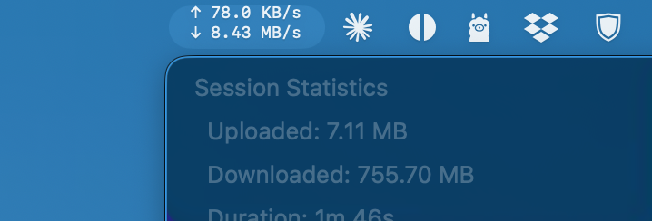

# NetMonitor

A lightweight macOS menu bar app that displays real-time network upload and download speeds.



## Features

- **Real-time speeds** - Upload and download speeds displayed in the menu bar
- **Compact vertical layout** - Shows ↑ upload and ↓ download on two lines
- **Session statistics** - Track total uploaded/downloaded data and session duration
- **Active interfaces** - See which network interfaces are currently active
- **Process monitoring** - View which apps are using network bandwidth
- **Idle tracking** - Recently active processes shown grayed out for 30 seconds
- **Menu bar only** - No dock icon, runs quietly in the background

## Installation

### Download Release
1. Download the latest `NetMonitor.app.zip` from [Releases](https://github.com/petrusp/NetMonitor/releases)
2. Unzip and drag `NetMonitor.app` to your Applications folder
3. Launch NetMonitor from Applications
4. (Optional) Add to Login Items to start automatically

### Build from Source
```bash
git clone https://github.com/petrusp/NetMonitor.git
cd NetMonitor
xcodebuild -project NetMonitor.xcodeproj -scheme NetMonitor -configuration Release build
```

The built app will be in `~/Library/Developer/Xcode/DerivedData/NetMonitor-*/Build/Products/Release/`

## Usage

- **Menu bar** - Shows current upload/download speeds
- **Click** - Opens dropdown with detailed statistics
- **Quit** - Select "Quit Network Monitor" from the dropdown menu

## Requirements

- macOS 12.0 (Monterey) or later
- Apple Silicon or Intel Mac

## License

MIT License - feel free to use and modify.
